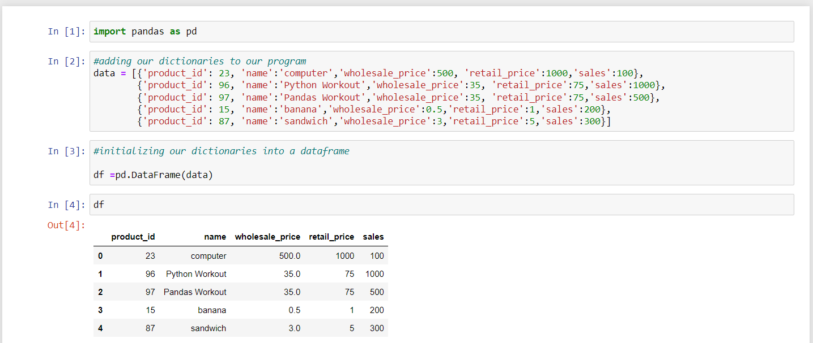
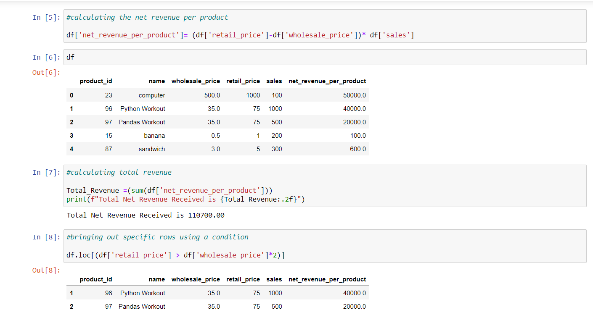
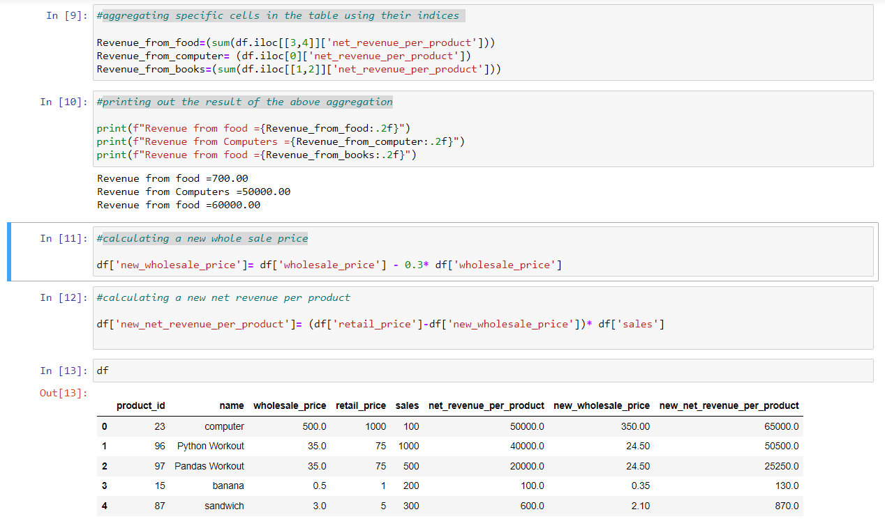

# Pandas-Dataframes
Working with pandas Dataframes

## Create a DataFrame from the list of dictionaries below:

1. Import pandas library
2. Added dictionary to the program
3. Initialize the dictionary in a DataFrame

## Analyzing and Calculations in pandas

4. Calculate the net revenue per product
5. Calculate total revenue
6. Indicate specific rows using a condition

## Aggreagating and Adding new columns to dataframe

7. Aggregate specific cells in the table using their indices
8.  Print out the result of the above aggregation
9. Create new columns by calculating new whole sale price and new net revenue per product.
10. Call the dataframe to visualise

